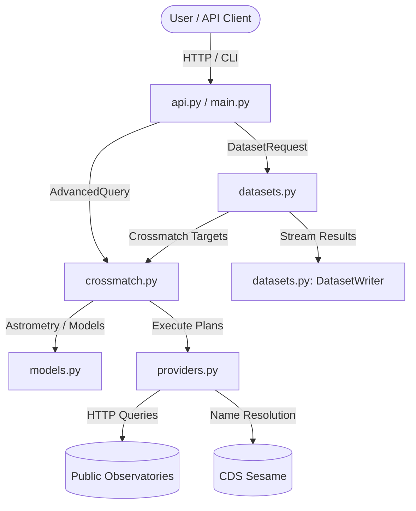

# AstroSearch Technical Documentation

AstroSearch is a high-performance astronomical catalog cross-matching engine and multi-format dataset generator built in Python. This document provides the complete technical specification for the architecture, catalog registry, query DSL, REST API endpoints, dataset pipeline, and production deployment.

---

## Table of Contents
1. [Monolithic Architecture Overview](#1-monolithic-architecture-overview)
2. [Catalog Registry Inventory](#2-catalog-registry-inventory)
3. [Query DSL & Astrometric Engine](#3-query-dsl--astrometric-engine)
4. [Streaming Dataset Pipeline & Storage](#4-streaming-dataset-pipeline--storage)
5. [HTTP REST API Reference](#5-http-rest-api-reference)
6. [Security, Quotas & Resilience](#6-security-quotas--resilience)
7. [Operations & Environment Configuration](#7-operations--environment-configuration)

---

## 1. Monolithic Architecture Overview

AstroSearch is consolidated into **6 monolithic Python scripts** residing at the project root:

```
AstroSearch/
├── models.py       # Data models, coordinate validation, normalizers, parsers, and registry
├── providers.py    # HTTP adapters for public archives, Sesame resolver, resilience & caching
├── crossmatch.py   # Query planner/executor, spatial math, proper-motion propagation & DSU grouping
├── datasets.py     # Streaming DatasetWriter (JSON/CSV/Parquet/FITS), engine, storage & jobs
├── api.py          # FastAPI REST service, Pydantic schemas, auth, quotas, metrics & 15 endpoints
└── main.py         # Programmatic facade, unified CLI, and built-in offline test suite
```

### Module Interactions & Data Flow



---

## 2. Catalog Registry Inventory

The built-in registry (`models.py: DEFAULT_CATALOGS`) declares 19 astronomical catalogs across 5 distinct protocol providers:

| Catalog ID | Provider | Wavelength | Protocol / Method | Primary Table / Catalog | Default Profiles |
|---|---|---|---|---|---|
| `gaia_dr3` | `tap` | Optical | ADQL Cone Search | `gaiadr3.gaia_source` | `full`, `optical`, `stellar` |
| `simbad` | `tap` | Multi | ADQL Positional Query | `basic` | `full`, `optical`, `stellar`, `identity` |
| `ned` | `tap` | Extragalactic | ADQL Positional Query | `objdir` | `full`, `optical`, `extragalactic`, `identity` |
| `exoplanet_archive` | `tap` | Exoplanet | ADQL Positional Query | `ps` | `full`, `exoplanet`, `stellar` |
| `vizier_2mass_reference` | `tap` | Infrared | ADQL Cone Search | `II/246/out` | `full`, `infrared`, `stellar` |
| `twomass_psc` | `irsa_gator` | Infrared | IPAC ASCII Cone Search | `fp_psc` | `full`, `infrared`, `stellar` |
| `allwise` | `irsa_gator` | Infrared | IPAC ASCII Cone Search | `allwise_p3as_psd` | `full`, `infrared`, `stellar` |
| `panstarrs_dr2` | `mast` | Optical | Positional REST API | Mean Object Catalog | `full`, `optical`, `extragalactic` |
| `sdss` | `sdss` | Optical | CSV SkyServer Cone | PhotoObj / Primary | `full`, `optical`, `extragalactic`, `spectroscopy` |
| `first` | `heasarc_xamin` | Radio | Xamin Positional Search | `first` (1.4 GHz) | `full`, `radio`, `extragalactic` |
| `nvss` | `heasarc_xamin` | Radio | Xamin Positional Search | `nvss` (1.4 GHz all-sky) | `full`, `radio`, `extragalactic` |
| `vlass` | `heasarc_xamin` | Radio | Xamin Positional Search | `vlass` (3 GHz) | `full`, `radio`, `extragalactic` |
| `lotss` | `heasarc_xamin` | Radio | Xamin Positional Search | `lotss` (120-168 MHz) | `full`, `radio`, `extragalactic` |
| `rosat` | `heasarc_xamin` | X-ray | Xamin Positional Search | `rosmaster` | `full`, `xray`, `high-energy` |
| `chandra` | `heasarc_xamin` | X-ray | Xamin Positional Search | `chandra` (CSC) | `full`, `xray`, `high-energy` |
| `xmm` | `heasarc_xamin` | X-ray | Xamin Positional Search | `xmm` (4XMM) | `full`, `xray`, `high-energy` |

---

## 3. Query DSL & Astrometric Engine

The search engine accepts either explicit sky coordinates or astronomical object names and evaluates complex geometric, astrophysical, and temporal constraints.

### Coordinate Astrometry & Epoch Propagation
- **Right Ascension / Declination**: RA is normalized to $[0^\circ, 360^\circ)$ and Dec is validated within $[-90^\circ, 90^\circ]$.
- **Proper Motion Correction**: If target epoch $t$ and source epoch $t_0$ are defined with proper motions $(\mu_{\alpha*}, \mu_{\delta})$, AstroSearch propagates coordinates via Astropy's `SkyCoord.apply_space_motion`:
  $$\text{coord}(t) = \text{coord}(t_0) + \Delta t \cdot (\mu_{\alpha*}, \mu_{\delta})$$
- **Separation & Match Confidence**: Angular separation $\theta$ is computed via spherical trigonometry. Probabilistic confidence $C$ is computed using Gaussian positional uncertainties $\sigma = \sqrt{\sigma_{\text{source}}^2 + \sigma_{\text{target}}^2}$:
  $$C = \exp\left( -0.5 \left(\frac{\theta}{\sigma}\right)^2 \right)$$

### Search Modes & Filters
1. **`cone` Mode**: Standard spherical cone search within $\theta \le r_{\text{max}}$.
2. **`shell` Mode**: Annular ring search where $r_{\text{min}} \le \theta \le r_{\text{max}}$.
3. **`cylinder` Mode**: 3D spatial cylinder filtering by distance bounds $[d_{\text{min}}, d_{\text{max}}]$ in parsecs. For sources with parallax $\varpi$ (in mas), distance is derived as:
   $$d = \frac{1000}{\varpi} \text{ pc}$$
4. **Adaptive Radius**: When enabled, if dense clustering is detected, the search radius is dynamically scaled to $1.5 \times \text{median}(\theta_{1\dots 5})$ to eliminate field contamination.
5. **Spatial Exclusion Polygons**: Point-in-polygon ray-casting filters out exclusion zones while handling $0^\circ / 360^\circ$ RA wrap-around.
6. **Object Type Canonicalization**: Maps raw archive designations (`*`, `G`, `QSO`, `cl*`) to canonical classifications (`star`, `galaxy`, `quasar`, `star_cluster`, `nebula`).
7. **Disjoint-Set Union (DSU) Grouping**: Detections across all queried catalogs are clustered into coherent physical astrophysical objects (`object-1`, `object-2`, etc.) based on mutual positional consistency within allowable positional error bubbles.

---

## 4. Streaming Dataset Pipeline & Storage

The dataset generation engine in `datasets.py` is engineered for high throughput and memory efficiency.

### Streaming Multi-Format Exports
- **Parquet (`.parquet`)**: Writes chunked PyArrow tables in batches of 1,000 rows with `zstd` compression. Enables multi-gigabyte dataset exports with bounded memory footprints.
- **JSON (`.json`)**: Memory-efficient streaming bracketed JSON array writer.
- **CSV (`.csv`)**: Standard delimited tabular format with serialized JSON sub-dictionaries.
- **FITS (`.fits`)**: Astropy binary table HDU format for astronomical tools (SAOImageDS9, TOPCAT).

### Storage Backends
- **Metadata Store (`MetadataStore`)**: Stores job states (`queued`, `running`, `completed`, `failed`), total source counts, catalog provenance, and saved query histories. Supports local SQLite (`metadata.sqlite3`) and production PostgreSQL via `DATABASE_URL`.
- **Object Store (`ObjectStore`)**: Supports AWS S3 and MinIO via `boto3`. Exported files can be streamed directly to cloud buckets.

### Asynchronous Worker Architecture
Dataset creation jobs run asynchronously. If `REDIS_URL` is provided, jobs are offloaded to an external Redis RQ worker queue. Otherwise, jobs execute safely in FastAPI's local background tasks.

---

## 5. HTTP REST API Reference

The service runs on FastAPI and exposes an interactive OpenAPI Swagger interface at `/api/docs`.

### 1. Health & Catalogs

#### `GET /api/v1/health`
Returns system health status and UTC timestamp.
```json
{
  "status": "healthy",
  "timestamp": "2026-09-20T04:15:00.000000Z",
  "version": "0.2.0"
}
```

#### `GET /api/v1/catalogs`
Returns the complete dictionary of enabled catalog definitions.

#### `GET /api/v1/catalogs/{catalog_name}`
Returns details of a specific catalog (e.g., `gaia_dr3`, `simbad`, `allwise`).

---

### 2. Crossmatch Search

#### `POST /api/v1/search`
Execute crossmatch by coordinates or object name.

**Request Payload:**
```json
{
  "ra": 187.705930,
  "dec": 12.391123,
  "radius_arcsec": 5.0,
  "profile": "optical",
  "object_types": ["galaxy"],
  "min_confidence": 0.8,
  "search_mode": "cone",
  "proper_motion": true,
  "max_results": 10
}
```

*Alternatively, search by object name:*
```json
{
  "name": "M87",
  "radius_arcsec": 5.0,
  "profile": "optical"
}
```

**Response Payload (`UnifiedRecord`):**
```json
{
  "target": { "ra": 187.70593, "dec": 12.391123, "frame": "icrs" },
  "catalogs_queried": 6,
  "catalog_results": { ... },
  "counterparts": {
    "optical": [
      {
        "catalog": "gaia_dr3",
        "source_id": "3920194829102",
        "ra": 187.705928,
        "dec": 12.391122,
        "separation_arcsec": 0.0075,
        "confidence": 0.9998,
        "physical": { "object_type": "galaxy", "redshift": 0.00428 }
      }
    ]
  },
  "failures": [],
  "crossmatch_groups": [
    {
      "group_id": "object-1",
      "catalogs": ["gaia_dr3", "simbad"],
      "wavelengths": ["optical", "multi"],
      "members": [ ... ]
    }
  ],
  "provenance": {
    "query_radius_arcsec": 5.0,
    "effective_radius_arcsec": 5.0,
    "matches": [ ... ]
  }
}
```

#### `POST /api/v1/search/batch`
Executes an array of `SearchRequest` objects concurrently with `max_concurrent` query parameter control.

---

### 3. Datasets

#### `POST /api/v1/datasets/create`
Submits an asynchronous dataset creation job. Returns `HTTP 202 Accepted` with a `Location` header.

**Request Payload:**
```json
{
  "name": "virgo_cluster_galaxies",
  "profile": "extragalactic",
  "radius_arcsec": 10.0,
  "object_types": ["galaxy"],
  "count_threshold": 2,
  "export_format": "parquet",
  "targets": [
    { "ra": 187.70593, "dec": 12.39112 },
    { "ra": 186.45360, "dec": 12.88699 }
  ]
}
```

**Response (HTTP 202):**
```json
{
  "id": "7f8b9a1c2d3e4f5a6b7c8d9e0f1a2b3c",
  "name": "virgo_cluster_galaxies",
  "profile": "extragalactic",
  "status": "queued",
  "total_sources": 0,
  "output_format": "parquet",
  "created_at": "2026-09-20T04:15:00.000000Z"
}
```

#### `GET /api/v1/datasets`
List all created datasets with statuses (`queued`, `running`, `completed`, `failed`).

#### `GET /api/v1/datasets/{dataset_id}`
Get metadata, total source count, and status for a specific dataset.

#### `GET /api/v1/datasets/{dataset_id}/export`
Download the exported file (`.parquet`, `.csv`, `.json`, or `.fits`).

#### `DELETE /api/v1/datasets/{dataset_id}`
Deletes dataset record from metadata database and removes the file from local storage / S3.

---

### 4. Saved Queries & Diagnostics

#### `GET /api/v1/queries`
Lists all saved search queries.

#### `POST /api/v1/queries`
Save a search query for reuse.
```json
{
  "name": "Standard-Virgo-Search",
  "query": { "ra": 187.70593, "dec": 12.39112, "radius_arcsec": 5.0 }
}
```

#### `DELETE /api/v1/queries/{query_id}`
Deletes saved query record.

#### `GET /api/v1/stats`
Returns system-wide counts:
```json
{
  "datasets": 14,
  "sources_exported": 842910,
  "saved_queries": 8
}
```

#### `GET /api/v1/monitoring`
Inspect provider circuit breaker states (`closed`, `half_open`, `open`).

#### `GET /api/v1/monitoring/metrics`
Prometheus metrics scrape endpoint format exposing `astrosearch_requests_total`, `astrosearch_request_latency_seconds`, `astrosearch_active_requests`, `astrosearch_catalog_queries_total`, and `astrosearch_catalog_query_seconds`.

---

## 6. Security, Quotas & Resilience

### Authentication
AstroSearch supports dual-mode authentication via `api.py: authenticate()`:
1. **API Keys**: Configured via `API_KEYS=key1,key2`. Clients supply keys via header `x-api-key: key1` or `Authorization: Bearer key1`.
2. **JWT Bearer Tokens**: Validated using RSA public key (`JWT_PUBLIC_KEY`) or HMAC secret (`JWT_SECRET`) with issuer (`JWT_ISSUER`) and audience (`JWT_AUDIENCE`) verification.

### Sliding-Window Rate Limiting
The `RequestQuota` middleware enforces per-minute rate limits (configured via `API_RATE_LIMIT_PER_MINUTE=60`). When Redis is available, rate limits are coordinated across distributed instances using sliding minute buckets.

### Circuit Breakers & Backoff
`EndpointGuard` tracks endpoint failures. If an upstream archive returns consecutive errors exceeding `PROVIDER_FAILURE_THRESHOLD=5`, the circuit trips to `open` for `PROVIDER_RECOVERY_SECONDS=30`. Calls fail fast with `CatalogUnavailableError` instead of hanging or exhausting client connections.

---

## 7. Operations & Environment Configuration

### Complete Environment Variable Reference

| Variable | Default | Description |
|---|---|---|
| `APP_NAME` | `astro-crossmatch` | Name of the application instance |
| `LOG_LEVEL` | `INFO` | Logging level (`DEBUG`, `INFO`, `WARNING`, `ERROR`) |
| `DEFAULT_RADIUS_ARCSEC` | `3.0` | Default search radius in arcseconds |
| `REQUEST_TIMEOUT_SECONDS` | `30.0` | Upstream archive HTTP request timeout |
| `MAX_RESPONSE_BYTES` | `10000000` | Max bytes allowed from upstream catalog responses |
| `MAX_REQUEST_BYTES` | `1048576` | Max API request body size (1 MB default) |
| `SESAME_ENDPOINT` | `https://cds.unistra.fr/cgi-bin/nph-sesame/-oxp/SNV` | CDS Sesame XML resolver URL |
| `DATABASE_URL` | `sqlite:///datasets/metadata.sqlite3` | SQLite or PostgreSQL metadata connection URL |
| `DATASET_STORAGE_PATH` | `datasets` | Local filesystem directory for dataset files |
| `REDIS_URL` | None | Redis connection URL for caching and job queue |
| `S3_BUCKET` | None | AWS S3 or MinIO bucket name for dataset storage |
| `S3_ENDPOINT_URL` | None | Custom S3 endpoint URL (e.g. MinIO) |
| `API_KEYS` | None | Comma-separated list of valid API keys |
| `REQUIRE_API_KEY` | `false` | Require authentication on all non-health endpoints |
| `API_RATE_LIMIT_PER_MINUTE` | `60` | Max API requests per minute per client |
| `CORS_ORIGINS` | `*` | Allowed CORS origin domains |
